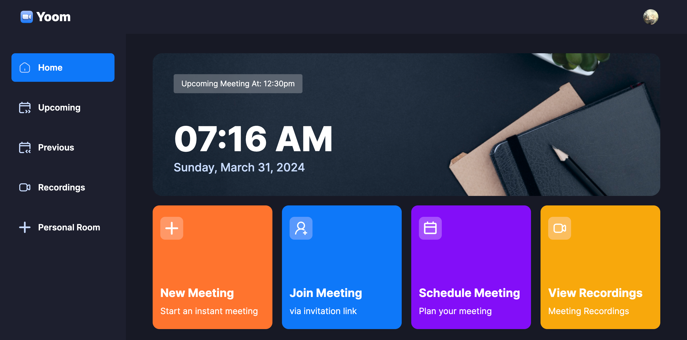

# Yoom: A video meeting app

Connecting faces, bridging spaces: Yoom, where every moment matters.

## [Demo Link](https://yooom.vercel.app/)

## Features

- Authentication & Authorization: Securely log in via Clerk, with options for social sign-on or email/password methods. Ensures appropriate access levels and permissions.
- Meeting Management: Quickly start or schedule meetings, with customizable camera and microphone settings. Full control over meeting aspects like recording, reactions, screen sharing, muting/unmuting, and participant management.
- Meeting Handling: Seamless exit options for participants or creators to end meetings. Access past meetings and recordings for review or reference.
- Personal Room & Joining Meetings: Each user gets a personal room for instant meetings with a unique link. Join meetings easily via shared links.
- Security & Responsive Design: Real-time, secure interactions maintained across all devices with responsive design principles for optimal user experience.

## Tech Stack
- Next.js
- TypeScript
- Clerk
- getstream-io
- shadcn
- Tailwind CSS

## Acknowledgements

 - [Video for Reference (JS Mastery)](https://www.youtube.com/@javascriptmastery)
 - [Clerk Auth](https://clerk.com/docs/quickstarts/nextjs)
 - [getStream-io](https://getstream.io/video/docs/react/)

## Environment Variables

To run this project, you will need to add the following environment variables to your .env file

`NEXT_PUBLIC_CLERK_PUBLISHABLE_KEY`

`CLERK_SECRET_KEY`

`NEXT_PUBLIC_CLERK_SIGN_IN_URL`=/sign-in
`NEXT_PUBLIC_CLERK_SIGN_UP_URL`=/sign-up

`NEXT_PUBLIC_STREAM_API_KEY`
`STREAM_SECRET_KEY`
